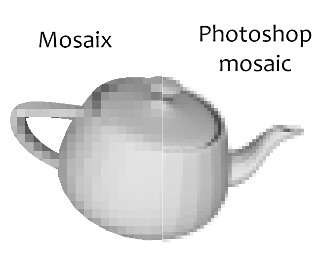

This is a standalone implementation of the [Unity Mosaix shader](https://github.com/noisefloordev/mosaix),
with a commandline implementation and a Photoshop filter.  This allows correctly mosaicing transparent images:

Mosaix retains the original shape of the transparent layer, where Photoshop and other mosaic
filters mosaic the shape itself.

The mosaic can also be shifted and applied at an angle (this isn't currently exposed in the
commandline version).

Commandline
-----------

The commandline version supports PNG and EXR files.  Usage:

mosaix.exe [-n] input.exr output.exr block_size

- block_size: The pixel size of the mosaic.

- -n: Don't compress the output file.  This can improve performance for larger images, especially
for EXR output.

Photoshop
---------

To install, copy **mosaix-pm.8bf** to **C:\Program Files\Common Files\Adobe\Plug-Ins\CC** and restart
Photoshop.  The filter will appear in **Filter > Pixelate > Mosaix**.

